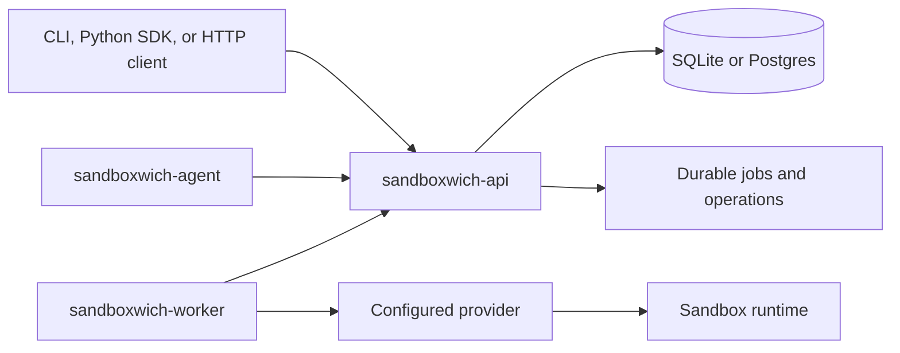

# sandboxwich

> Source-of-truth notice: this public repository is a compatibility snapshot.
> The authoritative source is [`evalops/mono`](https://github.com/evalops/mono)
> at `platform/execution/sandboxwich`; Mono's
> `.github/workflows/sandboxwich-publish.yml` is the only workflow allowed to
> publish Sandboxwich images or releases. Pull-request validation remains
> available here, but this repository must not publish artifacts.

sandboxwich is a typed Rust control plane for self-hosted, policy-controlled
development and agent-evaluation sandboxes.

The project is pre-1.0. Kubernetes apply mode and provider capabilities are
experimental; the [capability matrix](docs/capabilities.md) records current
evidence. Dry-run mode exercises control-plane behavior, while apply mode runs
a configured provider.

## Components

| Package | Purpose |
| --- | --- |
| `sandboxwich-api` | HTTP control plane. |
| `sandboxwich-cli` | CLI for sandbox and worker operations. |
| `sandboxwich-core` | Shared typed request, response, and event contracts. |
| `sandboxwich-worker` | Worker registration and provider execution. |
| `sandboxwich-agent` | Experimental guest-side daemon and CLI. |
| [`sdks/python`](sdks/python) | Typed Python client using `httpx` and Pydantic. |

## Architecture

The API owns durable state and operations. Workers claim typed jobs and hand
provider-specific work to the configured runtime backend.



## Quick start

This walkthrough uses SQLite and a Kubernetes dry-run worker. It validates the
control-plane flow without creating a runtime in Kubernetes.

Prerequisites: Rust 1.95 or newer and [`just`](https://github.com/casey/just).

In the first shell:

```sh
export SANDBOXWICH_API_TOKEN="local-development-token"
just dev
```

In a second shell:

```sh
export SANDBOXWICH_API_TOKEN="local-development-token"
cargo run -p sandboxwich-cli -- new --name demo --memory-limit 4g
cargo run -p sandboxwich-cli -- list

# Replace <sandbox-id> with the id returned by `new`.
cargo run -p sandboxwich-cli -- exec <sandbox-id> --wait -- echo hello
cargo run -p sandboxwich-cli -- events <sandbox-id>
```

`just dev` uses `http://127.0.0.1:3217` and `sqlite://sandboxwich.db` by
default. Press Ctrl-C in the first shell to stop the API and worker.

### HTTP smoke test

Tenant tokens use `Authorization: Bearer <token>`. Check the probe endpoint,
then create a sandbox through the versioned API:

```sh
curl -fsS http://127.0.0.1:3217/healthz

curl -fsS \
  -H "Authorization: Bearer ${SANDBOXWICH_API_TOKEN}" \
  -H "Content-Type: application/json" \
  -d '{"name":"api-demo","memory_limit":"4g","workspace_mode":"persistent"}' \
  http://127.0.0.1:3217/v1/sandboxes
```

The create response has HTTP status `202` and includes the sandbox and its
provisioning operation. Observe it with `sandboxwich events <sandbox-id>` or
`GET /v1/operations/{id}`.

For a real Kubernetes workflow, follow the [Kubernetes deployment
guide](docs/kubernetes.md). Apply mode requires both
`SANDBOXWICH_K8S_ENABLE_MUTATION=1` and `--confirm-apply`.

## Configuration

### API and storage

| Variable | Use |
| --- | --- |
| `SANDBOXWICH_API` | API URL; default `http://127.0.0.1:3217`. |
| `SANDBOXWICH_DATABASE_URL` | SQLite by default; Postgres for shared use. |
| `SANDBOXWICH_AUTO_MIGRATE` | Disable when migrations run as a separate job. |

The API exposes `/healthz`, `/readyz`, and `/metrics`. Probe routes are
unauthenticated; metrics follow the API authentication configuration.

### Authentication

Use `SANDBOXWICH_API_TOKEN` for one tenant or
`SANDBOXWICH_TENANT_TOKENS` for scoped credentials such as
`acme=abc123,globex=def456`. A shared token always maps to
`SANDBOXWICH_DEFAULT_TENANT`; the client tenant header cannot change it.

Requests fail closed when neither token mode is configured. The explicit
`SANDBOXWICH_ALLOW_INSECURE_NO_AUTH=true` override is for local development
only. `SANDBOXWICH_PROVIDER_ROUTING_TOKENS` and
`SANDBOXWICH_OPERATOR_TOKEN` are separate trusted credentials; do not reuse a
tenant token for either role.

### Workers and providers

Workers use `--provider` for the placement label and
`--runtime-provider` (or `SANDBOXWICH_RUNTIME_PROVIDER`) for the execution
backend. `--provider-mode` defaults to `dry-run`; `apply` executes provider
work. Supported runtime providers are `kubernetes`, `agent-sandbox`, and
`cloudflare`.

Cloudflare requires apply mode. Kubernetes apply also requires
`SANDBOXWICH_K8S_ENABLE_MUTATION=1` and `--confirm-apply`. Runtime image,
RuntimeClass, RBAC, storage, egress, secret delivery, and provider-specific
settings are in the [Kubernetes guide](docs/kubernetes.md).

Sandbox lifetime fields, persistent homes, sterile cells, secret references,
and other experimental capabilities are summarized in the [capability
matrix](docs/capabilities.md).

## Public API contract

The stable HTTP surface is versioned under `/v1`. The runtime-generated
OpenAPI document is served at `http://127.0.0.1:3217/v1/openapi.json`; the
committed contract is [`contracts/openapi.v1.json`](contracts/openapi.v1.json).

- Responses include `x-request-id`.
- Errors use `{ "ok": false, "code", "message" }`; branch on `code`.
- Mutating routes accept an optional tenant-scoped `Idempotency-Key`.
- Sandbox creation, stop, resume, and commands are asynchronous operations.
  Observe them with `GET /v1/operations/{id}` or its SSE event stream.
- Agents can use the same tenant bearer against `POST /mcp` (also
  `POST /v1/mcp`). The catalog is `box_create`, `box_list`, `box_get`,
  `box_exec`, `box_snapshot`, `box_fork`, `box_sleep`, `box_wake`,
  `box_destroy`, and `box_sizes`. `box_create` always uses a persistent
  workspace and requires `max_lifetime_seconds` or `idle_ttl_seconds`
  unless the operator set a default lifetime env var. `box_destroy`
  requires `confirm=true`.

See the [documentation map](docs/README.md) for lifecycle, persistent-home,
provider, contract, and performance details.

## Development

Run the repository gate with:

```sh
just gate
```

It checks formatting, workspace Clippy with warnings denied, and the full Rust
test suite. Set `SANDBOXWICH_TEST_POSTGRES_URL` to run Postgres-backed contract
tests; `just pg` starts a local Postgres 17 container.

Run the Python SDK tests with:

```sh
just py-test
```

See [`sdks/python/README.md`](sdks/python/README.md) for SDK setup and
examples. Benchmark commands live in the [performance harness
guide](docs/perf-harness.md).

## Further reading

- [Documentation map](docs/README.md)
- [Roadmap](ROADMAP.md)
- [Changelog](CHANGELOG.md)
- [Security policy](SECURITY.md)
- [Contributing guide](CONTRIBUTING.md)
