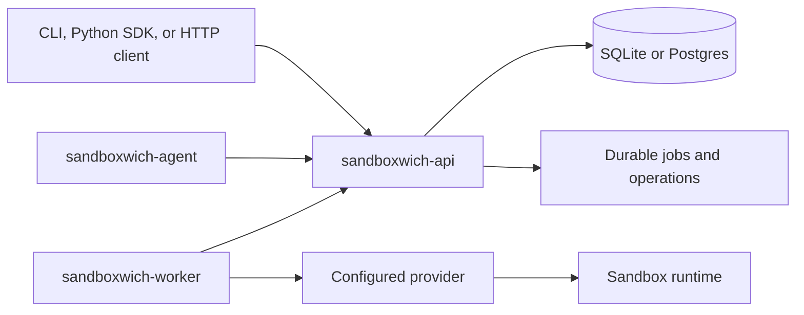
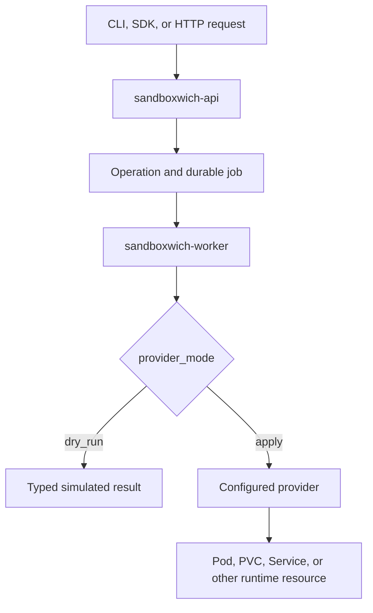
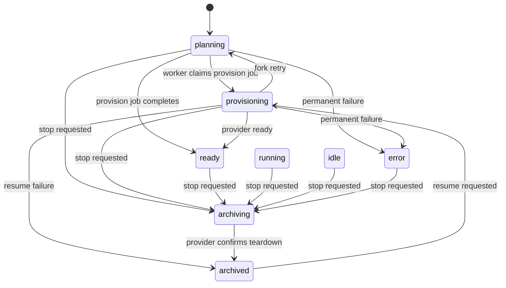

# sandboxwich

sandboxwich is a typed Rust control plane for self-hosted, policy-controlled
development and agent-evaluation sandboxes.

The project is pre-1.0. Kubernetes apply mode and provider capabilities are
experimental. The [capability matrix](docs/capabilities.md) records the
evidence for each provider path. Dry-run mode exercises control-plane behavior;
apply mode runs a configured provider.

## Components

| Package | Purpose |
| --- | --- |
| `sandboxwich-api` | HTTP control plane with SQLite for local development and Postgres for shared deployments. |
| `sandboxwich-cli` | CLI for creating, listing, stopping, resuming, forking, copying files, running commands, reading events, and inspecting runtime resources. |
| `sandboxwich-core` | Shared typed request, response, and event contracts. |
| `sandboxwich-worker` | Worker registration, heartbeats, job claiming, and provider execution. |
| `sandboxwich-agent` | Experimental guest-side daemon and CLI. The starter Ubuntu runtime image does not include it yet. |
| [`sdks/python`](sdks/python) | Typed Python client built with `httpx` and Pydantic v2. |

## Architecture

The API owns durable state and operations. Workers claim typed jobs and hand
provider-specific work to the configured runtime backend.



## Quick start

This walkthrough uses SQLite and a Kubernetes dry-run worker. It validates the
control-plane flow without creating a runtime in Kubernetes.

Prerequisites:

- Rust 1.95 or newer
- [`just`](https://github.com/casey/just) for the combined local process
- Docker for the Postgres-backed contract tests

In the first shell, start the API and dry-run worker:

```sh
export SANDBOXWICH_API_TOKEN="local-development-token"
just dev
```

In a second shell, use the CLI:

```sh
export SANDBOXWICH_API_TOKEN="local-development-token"
cargo run -p sandboxwich-cli -- new --name demo --memory-limit 4g
cargo run -p sandboxwich-cli -- list

# Replace <sandbox-id> with the id returned by `new`.
cargo run -p sandboxwich-cli -- exec <sandbox-id> --wait -- echo hello
cargo run -p sandboxwich-cli -- events <sandbox-id>
```

### HTTP smoke test

Tenant tokens use the `Authorization: Bearer <token>` header. Check the probe
endpoint, then create a sandbox through the versioned API:

```sh
curl -fsS http://127.0.0.1:3217/healthz

curl -fsS \
  -H "Authorization: Bearer ${SANDBOXWICH_API_TOKEN}" \
  -H "Content-Type: application/json" \
  -d '{"name":"api-demo","memory_limit":"4g","workspace_mode":"persistent"}' \
  http://127.0.0.1:3217/v1/sandboxes
```

The create response has HTTP status `202` and includes the sandbox and its
provisioning operation. Use `sandboxwich events <sandbox-id>` or
`GET /v1/operations/{id}` to observe that operation.

`just dev` uses the API defaults: `http://127.0.0.1:3217` and
`sqlite://sandboxwich.db`. Press Ctrl-C in the first shell to stop the API and
worker.

To run the API manually, prepare the schema and start the server:

```sh
cargo run -p sandboxwich-api -- migrate
cargo run -p sandboxwich-api -- serve
```

Then start a dry-run worker with the same token:

```sh
cargo run -p sandboxwich-worker -- run \
  --name local-dry-run \
  --provider kubernetes \
  --provider-mode dry-run
```

For a real Kubernetes workflow, follow the [Kubernetes deployment
guide](docs/kubernetes.md). Apply mode requires both
`SANDBOXWICH_K8S_ENABLE_MUTATION=1` and `--confirm-apply`. The guide covers
worker RBAC, namespaces, storage, egress policy, RuntimeClass configuration,
and secret delivery.

### Request execution

The API turns a typed request into a durable operation. The worker either
returns a simulated result or calls the configured provider.



## Configuration

### API and storage

| Variable | Default or use |
| --- | --- |
| `SANDBOXWICH_API` | `http://127.0.0.1:3217`; the CLI and worker API address. |
| `SANDBOXWICH_DATABASE_URL` | `sqlite://sandboxwich.db`; use a Postgres URL for shared deployments. |
| `SANDBOXWICH_DATABASE_MAX_CONNECTIONS` | Sets the API database pool size. |
| `SANDBOXWICH_AUTO_MIGRATE` | Leave enabled for local development. Set `false` when a deployment runs `migrate` as a separate job. |

The API exposes `/healthz`, `/readyz`, and `/metrics`. Health and readiness
are probe-friendly. The metrics endpoint follows the API authentication
configuration.

### Worker and provider

The worker has two provider names. `--provider` is the placement label sent to
the API; `--runtime-provider` selects the backend that executes the job.

| Setting | Use |
| --- | --- |
| `--provider` | Placement label sent to the API. Default: `kubernetes`. |
| `--runtime-provider` / `SANDBOXWICH_RUNTIME_PROVIDER` | Execution backend. |
| `--provider-mode` | `dry-run` simulates; `apply` executes. |
| `SANDBOXWICH_RUNTIME_IMAGE` | Kubernetes runtime image. |
| `SANDBOXWICH_RUNTIME_CLASS_NAME` | Kubernetes RuntimeClass. |

`SANDBOXWICH_RUNTIME_PROVIDER` accepts `kubernetes`, `agent-sandbox`, and
`cloudflare`; it defaults to `kubernetes`.
`--provider-mode` defaults to `dry-run`.

Cloudflare workers require `--provider-mode apply`. Kubernetes apply mode
also requires `SANDBOXWICH_K8S_ENABLE_MUTATION=1` and `--confirm-apply`.

### Authentication

Choose shared-token mode or scoped-token mode:

- `SANDBOXWICH_API_TOKEN` selects shared-token mode for a single-tenant
  deployment. Requests using it belong to `SANDBOXWICH_DEFAULT_TENANT`, which
  defaults to `default`; the `x-sandboxwich-tenant` header cannot change that
  identity.
- `SANDBOXWICH_TENANT_TOKENS` selects scoped-token mode with a
  comma-separated list such as
  `acme=abc123,globex=def456`. The token that matches a request determines its
  tenant.
- `SANDBOXWICH_PROVIDER_ROUTING_TOKENS` adds trusted provisioning credentials
  to scoped-token mode. Its comma-separated `tenant_id=service_token` entries
  bind a Cloudflare `organization:workspace` routing scope. Ordinary tenant
  credentials cannot set `x-sandboxwich-provider-routing-scope`.

If neither mode is configured, non-probe requests fail closed. The explicit
local-development override `SANDBOXWICH_ALLOW_INSECURE_NO_AUTH=true` trusts
the client-supplied tenant header and must not be used in a shared deployment.
Do not use a shared token for multiple tenants.

`SANDBOXWICH_OPERATOR_TOKEN` is a separate credential for operator routes such
as `POST /snapshots/cleanup`. Send it in the
`x-sandboxwich-operator-token` header.

### Sandbox lifetime

The three lifetime fields control different events:

| Field | Behavior |
| --- | --- |
| `ttl_seconds` | Retains an already-`archived` sandbox record until cleanup removes it. It does not stop a live sandbox. |
| `max_lifetime_seconds` | Stops a live sandbox after the configured duration from creation. |
| `idle_ttl_seconds` | Stops a live sandbox after no observed activity. Activity includes lifecycle transitions, queued guest commands, SSH access, desktop access, and resident-process observation. |

Set the fields with `sandboxwich new` or `sandboxwich fork`:

```sh
cargo run -p sandboxwich-cli -- new \
  --name demo \
  --max-lifetime-seconds 3600 \
  --idle-ttl-seconds 900
```

Operators can set defaults and ceilings with:

- `SANDBOXWICH_DEFAULT_MAX_LIFETIME_SECONDS`
- `SANDBOXWICH_MAX_MAX_LIFETIME_SECONDS`
- `SANDBOXWICH_DEFAULT_IDLE_TTL_SECONDS`
- `SANDBOXWICH_MAX_IDLE_TTL_SECONDS`

These variables are unset by default. A persistent workspace has no active
lifetime cap unless the caller or operator configures one.

### Security-sensitive features

Guest agents use credentials minted by the owning worker. A guest credential is
bound to one tenant, worker, sandbox, and expiry; it cannot call worker
administration routes. Do not copy a worker credential into a guest.

For API replica failover, set `SANDBOXWICH_BOOTSTRAP_HANDOFF_KEY` on every API
replica. Its value is standard base64 for exactly 32 bytes. Pending resident
bootstrap bytes are then sealed in an ephemeral database row. The variable is
required when `SANDBOXWICH_STERILE_RESIDENT_ACTIVATION_ENABLED=true`.

`/v1/secret-refs` stores locators for long-lived credentials in an
operator-owned external store. The Kubernetes provider delivers them through a
read-only Secrets Store CSI volume at
`/run/sandboxwich/secrets/<name>` and exposes the path through
`SANDBOXWICH_SECRET_<NAME>_FILE`. Credential material does not pass through the
control plane or a Kubernetes `Secret`. Secret delivery requires an operator
configured CSI driver.

## Public API contract

The stable HTTP surface is versioned under `/v1`. Unversioned routes are
temporary compatibility aliases. The runtime-generated OpenAPI document is
served at `http://127.0.0.1:3217/v1/openapi.json`, and the committed contract
is [`contracts/openapi.v1.json`](contracts/openapi.v1.json).

Responses include `x-request-id`. Errors use the stable envelope
`{ "ok": false, "code", "message" }`; clients should branch on `code`.

Mutating `/v1` routes accept an optional `Idempotency-Key`. Keys are scoped to
the authenticated tenant and retained for 24 hours. Repeating the same method,
URI, query, and body replays the original response. Reusing a key for a
different request returns `409 idempotency_key_reused`; a request still in
progress returns `409 idempotency_in_progress` with `Retry-After: 1`.

Sandbox creation, stop, and resume return `202` with an Operation. Commands can
be observed through `GET /v1/operations/{id}` or its SSE event stream, and a
queued command can be canceled with
`POST /v1/operations/{id}/cancel`.

### Sandbox lifecycle

The diagram shows provisioning, retry, stop, and resume transitions:



Managed persistent homes admit one live sandbox. A concurrent create returns
`409 home_already_mounted`; callers should re-read the home, then adopt or
wait for the authoritative sandbox. See the [persistent home lifecycle
contract](docs/persistent-home-lifecycle.md).

Operators can configure fixed-window tenant request and mutation limits with
`PUT /v1/operator/tenant-policies/{tenant_id}`. Exhausted budgets return
`429` with `tenant_rate_limit_exceeded` or
`tenant_mutation_quota_exceeded`.

## Development

Run the repository gate with:

```sh
just gate
```

It runs `cargo fmt --all -- --check`, workspace Clippy with warnings denied,
and `cargo test --workspace`.

The Postgres-backed contract tests run when
`SANDBOXWICH_TEST_POSTGRES_URL` is set. `just pg` starts a local Postgres 17
container and prints the export command. Stop it with:

```sh
docker stop sandboxwich-dev-postgres
```

Run the Python SDK tests with:

```sh
just py-test
```

See [`sdks/python/README.md`](sdks/python/README.md) for SDK setup and
examples.

## Benchmarks

Build the benchmark binaries and run the default HTTP and sandbox TTFT suite:

```sh
cargo build -p sandboxwich-api -p sandboxwich-worker -p sandboxwich-bench
cargo run -p sandboxwich-bench -- all \
  --api-bin target/debug/sandboxwich-api \
  --worker-bin target/debug/sandboxwich-worker \
  --runs 5 \
  --ttft-runs 10 \
  --requests 300 \
  --seed-sandboxes 250
```

Run only the sandbox TTFT path with:

```sh
cargo run -p sandboxwich-bench -- sandbox-ttft \
  --api-bin target/debug/sandboxwich-api \
  --worker-bin target/debug/sandboxwich-worker \
  --runs 20
```

## Further reading

- [Documentation map](docs/README.md)
- [Capability maturity matrix](docs/capabilities.md)
- [Kubernetes deployment guide](docs/kubernetes.md)
- [Persistent home lifecycle contract](docs/persistent-home-lifecycle.md)
- [Sterile-cell contract](docs/sterile-cells.md)
- [Roadmap](ROADMAP.md)
- [Changelog](CHANGELOG.md)
- [Security policy](SECURITY.md)
- [Contributing guide](CONTRIBUTING.md)
