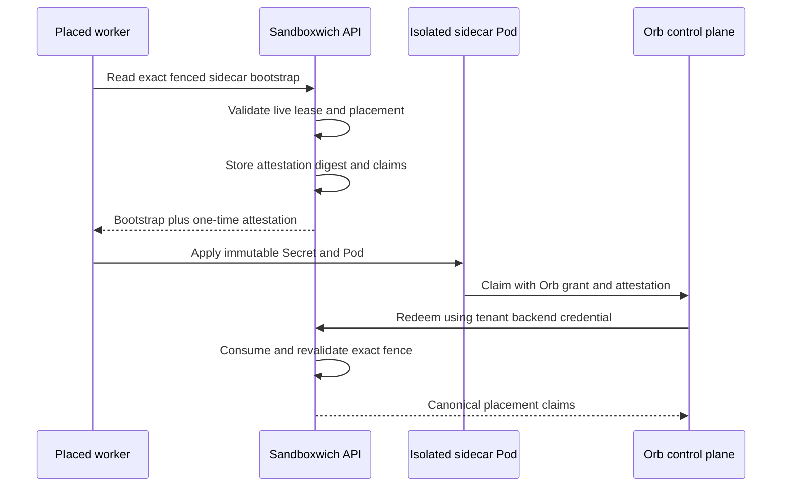

# Orb Placement Attestation - Plan

## Goal Capsule

- **Objective:** Let a provider-isolated `orb-sidecar` prove its exact live Sandboxwich placement to Orb once, while preserving lease fencing, sidecar-only credential custody, and deny-by-default networking.
- **Product authority:** Sandboxwich database rows for placement, worker ownership, resident-process generation, provider-isolation version, and active lease are authoritative; bootstrap contents, labels, request claims, and observed prose are not.
- **Execution profile:** One backward-compatible Sandboxwich PR that lands before Orb consumes the new contract.
- **Stop conditions:** Stop rather than issue an attestation without an exact live fence, expose raw enrollment material outside the isolated sidecar bootstrap, widen general sandbox egress, permit metadata-link-local ranges, or weaken existing bootstrap consumption semantics.
- **Tail ownership:** Implementation owns migrations, SQLite and PostgreSQL contract coverage where available, OpenAPI updates, worker/provider tests, documentation, CI, review, and merge to `main`.

---

## Product Contract

### Summary

Sandboxwich will mint a one-time opaque placement attestation during the exact fenced bootstrap delivery for a provider-isolated `orb-sidecar`. Orb can atomically redeem that proof through a tenant-authenticated backend endpoint and receive canonical placement claims, while the sidecar gains only a narrowly configured HTTPS path to Orb's issuer.

### Problem Frame

The isolated sidecar primitive proves that a dedicated Pod is running under a live lease, but it does not export that proof to Orb. A claim grant placed in bootstrap proves possession of Orb material, not that the claimant is the authoritative Sandboxwich leaseholder. Kubernetes service-account tokens and a second OIDC issuer do not carry Sandboxwich's exact resident-process generation, lease, placement generation, immutable image, and authoritative Pod identity, so they cannot replace the attestation fence. The sidecar NetworkPolicy also excludes private and control-plane CIDRs, so a private Orb issuer is unreachable without a narrowly scoped exception.

### Requirements

**Lease-attested enrollment**

- R1. Only a provider-isolated resident process named `orb-sidecar` using the additive provider-isolation v2 capability may receive a placement attestation.
- R2. The attestation must bind tenant, sandbox, resident-process ID and generation, lease and attempt, job, authoritative worker, placement generation, authoritative provider Pod UID, provider mode, immutable runtime image, provider-isolation version, issue time, `attestation_expires_at`, and authoritative `lease_expires_at`; attestation expiry cannot exceed the lease deadline.
- R3. Sandboxwich must persist only a digest of the raw attestation and consume it atomically at most once. The opaque value is deterministically derived from the exact fence and a restricted server-only derivation key, allowing crash-safe reconstruction without durable plaintext storage. A repeated redemption by the same tenant and request key is idempotent and returns the same live-revalidated claims; a distinct replay fails.
- R4. Redemption must revalidate the same tenant, current placement owner and generation, provider Pod UID, provider mode and immutable image, supported isolation version, running resident process, and unexpired active lease before returning claims. A separate versioned tenant-authenticated live-validation endpoint takes the durable attestation record identity and re-runs this canonical join for Orb renewal without accepting the raw proof.
- R5. Wrong-tenant, stale, expired, replayed, stopped, replaced, or mismatched attestations must fail without disclosing whether another tenant's proof exists.

**Custody and delivery**

- R6. The raw attestation may appear only in the sidecar bootstrap response, its bounded process-local exact-delivery replay entry, and the isolated sidecar Secret. The replay entry must expire no later than the attestation, be evicted after successful redemption or first-running acknowledgement, and be zeroized on eviction. The raw value must not enter executor bootstrap, argv, environment values, provider metadata, generic idempotency responses, logs, events, metrics, traces, or durable plaintext state.
- R7. Existing resident bootstrap generation/lease/digest fencing, delivery retry, and first-running acknowledgment semantics must remain unchanged for workloads without placement attestation.

**Private issuer networking**

- R8. Operators may configure explicit destination CIDRs that only provider-isolated sidecars may reach over TCP 443 in addition to DNS and carved public HTTPS.
- R9. Explicit sidecar destinations must reject malformed CIDRs, all-address ranges, ranges broader than `/24` for IPv4 or `/64` for IPv6, link-local metadata ranges, and other hard-forbidden destinations while preserving deny-all ingress and existing exclusions for every other workload. Operator documentation requires stable narrow issuer addresses or a stable private endpoint.

**Contracts and operations**

- R10. Shared DTOs, OpenAPI, worker deployment configuration, capability documentation, and redacted `Debug` output must describe an additive provider-isolation v2 contract that can coexist with v1 during rollout and rollback.
- R11. SQLite and PostgreSQL use one portable migration and identical atomic-consumption semantics.

### Key Flows

- F1. **Issue:** The authoritative worker reads the exact sidecar bootstrap under its live lease; the API commits bootstrap delivery and creates a short-lived hash-only attestation record from canonical rows; the response returns the server-derived opaque proof separately from arbitrary bootstrap bytes. Exact retries reconstruct or replay the same proof even after an API restart.
- F2. **Redeem and validate:** Orb presents the raw proof, an idempotency key, and its tenant credential; Sandboxwich atomically consumes it, revalidates the live fence and placement, and returns versioned claims without any reusable Sandboxwich credential. An identical retry returns the same freshly revalidated claims. Later renewals call the record-bound live-validation endpoint.
- F3. **Reach Orb:** The worker renders one sidecar-only TCP/443 NetworkPolicy entry for each validated operator CIDR while leaving executor and general sandbox policies unchanged.

### Acceptance Examples

- AE1. Given a running isolated `orb-sidecar` under an active exact lease, when its placed worker reads bootstrap and Orb redeems the returned proof, then Orb receives the canonical matching fence and deadlines; an identical request retry is idempotent while a distinct second redemption fails.
- AE2. Given the lease expires, the process stops, placement moves, or generation changes before redemption, when Orb presents the proof, then redemption fails and returns no claims.
- AE3. Given a normal `orb-executor` or a non-isolated resident process, when bootstrap is read, then no placement attestation is minted or returned.
- AE4. Given one configured private issuer CIDR, when manifests render, then only the isolated sidecar has TCP/443 egress to that CIDR; metadata, unrelated private ranges, and ingress remain denied.
- AE5. Given a canary token, when persisted rows, API responses other than the one-time sidecar delivery, provider metadata, executor inputs, diagnostics, and receipts are searched, then the raw token is absent.

### Scope Boundaries

- Included: one-time opaque issuance, atomic backend redemption, canonical claims, sidecar-only Secret injection, explicit private HTTPS CIDRs, OpenAPI, deployments, docs, and tests.
- Deferred: shared multi-replica bootstrap storage. Existing bootstrap delivery remains process-local and supported deployments retain their documented single-replica/affinity constraint.
- Excluded: making Sandboxwich an OIDC issuer, Kubernetes service-account token projection, a sidecar-to-Sandboxwich public redemption path, guest-to-sidecar proxy networking, real cloud account federation, or storing production keys.

---

## Planning Contract

### Key Technical Decisions

- KTD1. **Sandboxwich issues an opaque one-time attestation, not a workload JWT.** (session-settled: user-approved — chosen over Sandboxwich as a second OIDC issuer: Orb remains the portable issuer while Sandboxwich supplies lease authority.) Orb redeems through its existing tenant-authenticated backend client, so the isolated sidecar never receives a Sandboxwich API credential.
- KTD2. **The token is minted at fenced bootstrap delivery.** This is the first point where Sandboxwich knows the exact process, generation, lease, job, worker, and placement while still delivering only to the isolated sidecar Secret.
- KTD3. **Redemption is atomic, retry-safe, and live-validated.** A conditional update consumes the hash only when expiry and every current fence still match; exact request retries return revalidated claims, distinct replays fail, and representation alone is never treated as attestation. A record-bound backend endpoint performs the same validation for Orb renewal.
- KTD4. **The raw proof is a separate v2 bootstrap response field and Secret key.** Arbitrary tenant bootstrap bytes remain opaque, v1 workers keep their existing response, and executor bootstrap behavior remains byte-for-byte compatible.
- KTD5. **Private issuer access is an explicit sidecar-only allow, not an exception to global exclusions.** Dedicated validation rejects hard-forbidden networks, and manifest rendering adds exact TCP/443 rules without modifying public egress or guest policies.

### High-Level Technical Design

### Assumptions

- Orb already possesses the tenant-scoped Sandboxwich credential used by its provisioner and will be the only redemption caller.
- The default attestation TTL is derived from the observed placement-to-enrollment p99 plus bounded margin, capped by the lease deadline; 5 minutes is only the initial configured ceiling until latency evidence supports it. Renewal uses the record-bound live-state endpoint rather than the raw token.
- Explicit private issuer CIDRs are operator-managed stable narrow deployment data; dynamic issuers require a stable private endpoint because DNS-name policy remains outside native Kubernetes NetworkPolicy guarantees.

### Risks and Dependencies

- Concurrent bootstrap reads can mint or expose two proofs unless issuance shares the existing delivery fence; the implementation must prove one live record per exact process-generation-lease.
- A database commit followed by response loss or process restart must remain recoverable: the derivation key and exact persisted fence reconstruct the same opaque proof, while redemption request idempotency recovers a lost claims response.
- PostgreSQL contract tests require `SANDBOXWICH_TEST_POSTGRES_URL`; absence must be reported distinctly rather than described as a passing PostgreSQL gate.

---

## Implementation Units

### U1. Versioned placement-attestation contract and persistence

- **Goal:** Add shared redacted DTOs and a portable hash-only attestation record.
- **Requirements:** R2-R5, R10-R11.
- **Files:** `crates/sandboxwich-core/src/lib.rs`, `crates/sandboxwich-api/migrations/20260718000500_resident_placement_attestations.sql`, `crates/sandboxwich-api/src/api_contract.rs`, `crates/sandboxwich-api/tests/http_contract/common.rs`.
- **Approach:** Define versioned redemption and record-bound live-validation request/response claims with bounded strings and UUIDs, distinct attestation/lease deadlines, and provider Pod UID. Add unique fencing and digest indexes, expiry, consumption, and idempotency columns, and no raw-token column.
- **Test Scenarios:** DTO round trip and redacted debug; migration on SQLite and PostgreSQL; schema contains digest but no plaintext field; duplicate exact fence is rejected or reused deterministically.
- **Verification:** Focused core tests, migration tests, and API contract generation checks pass.

### U2. Fenced issuance, atomic redemption, and live validation

- **Goal:** Produce one logical proof at isolated sidecar bootstrap delivery, redeem it atomically with crash-safe retry semantics, and expose the same canonical live fence for renewal.
- **Requirements:** R1-R7; F1-F2; AE1-AE3, AE5.
- **Files:** `crates/sandboxwich-api/src/handlers/resident_processes.rs`, `crates/sandboxwich-api/src/handlers/resident_attestations.rs`, `crates/sandboxwich-api/src/routes.rs`, `crates/sandboxwich-api/src/auth.rs`, `crates/sandboxwich-api/src/state.rs`, `crates/sandboxwich-api/tests/http_contract/resident_processes.rs`, `crates/sandboxwich-api/tests/http_contract/resident_attestations.rs`.
- **Approach:** Derive cryptographically opaque material from a restricted server key and the canonical exact fence, store only SHA-256 plus the record identity and idempotency digest, and bound any process-local replay copy. Add tenant-authenticated redemption and record-bound live-validation routes whose transactions join and revalidate resident process, active lease, job, worker, placement, Pod UID, provider mode/image, and isolation version.
- **Test Scenarios:** success; identical redemption retry; distinct replay; concurrent double spend; issue-response loss across API restart; redemption-response loss; expiry; wrong tenant; wrong process/generation/lease; stopped or lost process; replaced Pod, worker, image, provider mode, or placement generation; unsupported isolation version; active renewal validation and lease deadline; no proof for executor or ordinary resident bootstrap; canary sweep.
- **Verification:** Focused SQLite HTTP contract tests pass; PostgreSQL variants pass when configured.

### U3. Versioned sidecar-only Secret injection

- **Goal:** Advertise provider-isolation v2 and carry the issued proof from a v2 worker response into the provider-isolated Pod without exposing it to the guest.
- **Requirements:** R6-R7; F1; AE3, AE5.
- **Files:** `crates/sandboxwich-core/src/lib.rs`, `crates/sandboxwich-worker/src/main.rs`, `crates/sandboxwich-worker/src/provider.rs`, `crates/sandboxwich-worker/src/provider/tests.rs`.
- **Approach:** Bump the capability only for workers that implement the additive response, extend the isolated bootstrap type with an optional redacted attestation, render a second immutable Secret key at a fixed sidecar-only file path, and leave the existing target bootstrap file untouched. Keep v1 accepted until v1 leases drain.
- **Test Scenarios:** v2 isolated sidecar receives both files with restrictive modes; v1 remains compatible without attestation; general resident and guest manifests contain neither key nor path; provider metadata and debug output redact the token; absent optional field preserves current manifests.
- **Verification:** Worker and provider manifest tests pass with secret-canary assertions.

### U4. Explicit private HTTPS egress

- **Goal:** Permit only configured isolated sidecars to reach a private Orb issuer over TLS.
- **Requirements:** R8-R9; F3; AE4.
- **Files:** `crates/sandboxwich-worker/src/main.rs`, `crates/sandboxwich-worker/src/provider.rs`, `crates/sandboxwich-worker/src/provider/tests.rs`, `deploy/kubernetes/worker.yaml`.
- **Approach:** Add a repeatable env/CLI CIDR option, parse and deduplicate at startup, reject all-address, over-broad, and hard-forbidden link-local destinations, and render separate exact TCP/443 egress entries ahead of the carved public rule.
- **Test Scenarios:** valid private IPv4 and IPv6 CIDRs; duplicate normalization; malformed and broad CIDRs; metadata rejection; DNS/public preservation; no ingress; no executor or ordinary sandbox policy expansion.
- **Verification:** Provider configuration and manifest tests pass, and deployment manifests parse.

### U5. Contracts, documentation, and full regression gates

- **Goal:** Publish the dependency contract Orb can consume and prove no regression in resident-process reliability.
- **Requirements:** R10-R11 and all acceptance examples.
- **Files:** `docs/capabilities.md`, `docs/kubernetes.md`, `crates/sandboxwich-api/src/api_contract.rs`, generated OpenAPI artifacts, relevant deployment tests.
- **Approach:** Document topology, TTL, one-time semantics, private-network configuration, multi-replica limitation, and failure behavior. Run focused tests before full gates and record PostgreSQL applicability.
- **Test Scenarios:** generated OpenAPI stays current; docs describe sidecar-to-Orb-to-Sandboxwich flow; full workspace tests retain bootstrap and cleanup invariants.
- **Verification:** All commands in the Verification Contract pass or are reported with their documented applicability.

---

## Verification Contract

| Gate | Command | Done signal |
|---|---|---|
| Formatting | `cargo fmt --check` | No formatting diff. |
| Lint | `cargo clippy --workspace --all-targets -- -D warnings` | No warnings or errors. |
| Focused API | `cargo test -p sandboxwich-api --test http_contract resident_attestations resident_processes` | Issuance, redemption, replay, and negative fences pass on SQLite. |
| Focused worker | `cargo test -p sandboxwich-worker provider` | Secret and NetworkPolicy manifests satisfy isolation assertions. |
| Full Rust | `cargo test --workspace` | All workspace tests pass. |
| PostgreSQL | `SANDBOXWICH_TEST_POSTGRES_URL=<configured> cargo test -p sandboxwich-api --test http_contract resident_attestations resident_processes` | PostgreSQL issuance and redemption contracts pass when the environment supplies a test server. |
| API and manifests | Repository OpenAPI/deployment contract tests | Generated API and checked-in Kubernetes configuration agree. |
| Diff safety | `git diff --check` and secret-canary search | No whitespace errors or raw attestation outside the one-time delivery fixture. |

---

## Definition of Done

- Every requirement and acceptance example is covered by a passing test or an explicit environment-gated proof.
- Orb can redeem one valid provider-isolated sidecar attestation, recover identical ambiguous retries, and reject distinct replay after success.
- Orb can recheck the complete live resident fence and authoritative lease deadline through the record-bound backend endpoint without persisting or replaying the raw proof.
- Only isolated sidecars receive the proof and explicit private TCP/443 egress.
- Existing executor bootstrap, general network policy, cleanup, and lease behavior remain green.
- OpenAPI, deployment configuration, and capability documentation are current.
- Provider-isolation v1 and v2 coexist during rollout, and rollback retains v2 schema/acceptance until v2 leases drain.
- Full local gates and required CI pass on a branch containing current `main`; PostgreSQL applicability is reported accurately.
- Review findings are resolved, abandoned experimental code is removed, and a merge commit is present on `origin/main`.
